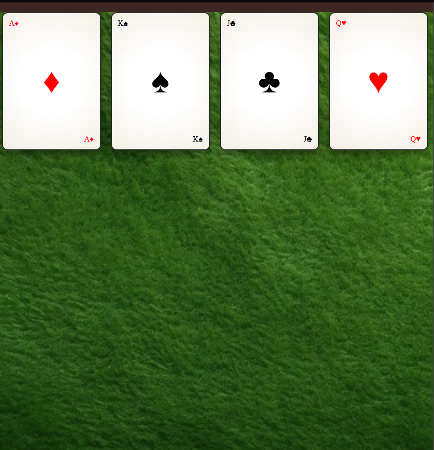

# Playing Cards PC FCC

Certification project completed for the **Flexbox** path on freeCodeCamp! In this challenge, I built a responsive layout of four playing cards distributed across the screen, applying alignment logic and axis distribution using CSS Flexbox.

To give it a unique and personal touch, the visual design is heavily inspired by the retro and stylized aesthetics of the acclaimed indie game **Balatro**.

## 🚀 Features & Techniques Applied
* **Responsive Layout:** Applied `display: flex`, `flex-wrap: wrap`, and spacing properties (`justify-content`, `gap`) to create a fully adaptable game board.
* **Axis Alignment:** Managed the internal layout of each card (top, middle, and bottom zones) by switching between row and column orientations using `flex-direction`.
* **Balatro Styling:** Implemented smooth backgrounds using `radial-gradient`, depth with `box-shadow`, and distinct rounded corners.

## 📸 Project Preview

Here is how the final board looks with the casino table layout and customized cards:

---
*Developed with dedication to keep mastering Frontend development on freeCodeCamp.*